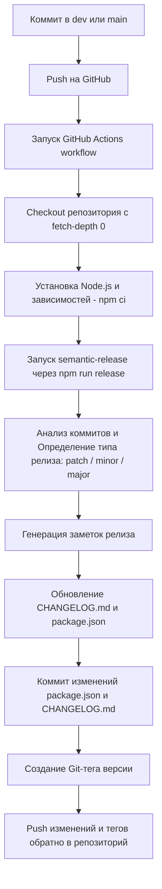

# Plug-and-play semantic-release setup with CHANGELOG and versioning

## Инструкция для внедрения системы семантического релиза

1️⃣ Первичное создание git tag происходит с помощью npm run release

2️⃣ Настройка npm-токена

Создать npm-токен в аккаунте npm:
https://www.npmjs.com/settings/your_username/tokens
Добавить токен в GitHub Secrets как NPM_TOKEN.
Этот токен нужен для обновления package.json.version через npm-плагин даже если публикация отключена (npmPublish: false).

3️⃣ Установка зависимостей

npm install --save-dev semantic-release @semantic-release/git @semantic-release/changelog @semantic-release/npm @semantic-release/commit-analyzer @semantic-release/release-notes-generator

4️⃣ Создание конфигурации .releaserc.json

5️⃣ Настройка GitHub Actions workflow \.github\workflows\release.yml

6️⃣ Создание npm скрипта для релиза

В package.json:
"scripts": {
  "release": "semantic-release"
}

## Коммит-месседж и правила версий

Semantic-release использует Conventional Commits, по умолчанию:
| Тип коммита                               | Версия | CHANGELOG          |
| ----------------------------------------- | ------ | ------------------ |
| `fix:`                                    | patch  | Bug Fixes          |
| `feat:`                                   | minor  | Features           |
| `feat!:` или `fix!:` + `BREAKING CHANGE:` | major  | ⚠ BREAKING CHANGES |
| другие (`chore:`, `docs:`, `refactor:`)   | —      | не учитываются     |

Если есть несколько релевантных коммитов → выбирается самый “сильный” тип: major > minor > patch

Можно настроить правила версий в .releaserc.json в разделе "plugins":

```
      "@semantic-release/commit-analyzer",
      {
        "preset": "conventionalcommits",
        "releaseRules": [
          { "type": "chore", "release": "patch" },
          { "type": "refactor", "release": "patch" },
          { "type": "docs", "release": false },
          { "type": "style", "release": false },
          { "type": "test", "release": false }
        ]
      },
```
## Схема работы

