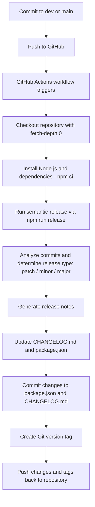

For Russian version, see [README.ru.md](README.ru.md)

# Plug-and-play semantic-release setup with CHANGELOG and version management

## Guide to implementing semantic-release

1️⃣ **Enable GitHub Actions workflow permissions**

In repository settings, go to:
`Settings → Actions → General → Workflow permissions → “Read and write permissions”`

This allows GitHub Actions to push changes (package.json, CHANGELOG.md, git tags).

2️⃣ **Set up npm token**

Create an npm token in your npm account:  
https://www.npmjs.com/settings/your_username/tokens

Add the token to GitHub Secrets as `NPM_TOKEN`.  
The token is required for updating `package.json.version` via the npm plugin, even if publication is disabled (`npmPublish: false`).

3️⃣ **Install dependencies**

```bash
npm install --save-dev semantic-release @semantic-release/git @semantic-release/changelog @semantic-release/npm @semantic-release/commit-analyzer @semantic-release/release-notes-generator
```

4️⃣ Create configuration file .releaserc.json

5️⃣ Set up GitHub Actions workflow .github/workflows/release.yml

6️⃣ Add npm release script

In package.json:
```
"scripts": {
  "release": "semantic-release"
}
```

## Commit messages and version rules

Semantic-release uses Conventional Commits by default:
| Commit type                              | Version | CHANGELOG          |
| ---------------------------------------- | ------- | ------------------ |
| `fix:`                                   | patch   | Bug Fixes          |
| `feat:`                                  | minor   | Features           |
| `feat!:` or `fix!:` + `BREAKING CHANGE:` | major   | ⚠ BREAKING CHANGES |
| others (`chore:`, `docs:`, `refactor:`)  | —       | not counted        |

If there are multiple relevant commits → the strongest type is chosen: major > minor > patch.

You can configure version rules in .releaserc.json under the plugins section:

```
      "@semantic-release/commit-analyzer",
      {
        "preset": "conventionalcommits",
        "releaseRules": [
          { "type": "chore", "release": "patch" },
          { "type": "refactor", "release": "patch" },
          { "type": "docs", "release": false },
          { "type": "style", "release": false },
          { "type": "test", "release": false }
        ]
      },
```
## Workflow diagram

